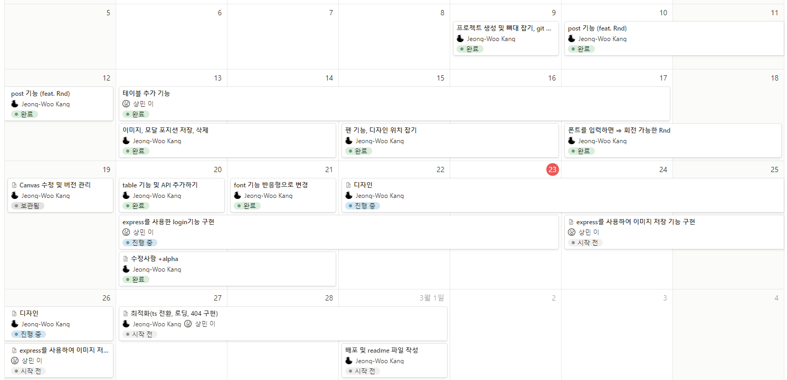

# 🎼 DP (Duckzil notePad)

## 🔊 Hot to start This Project?
1. download ZIP
2. type `npm init`
3. before running this app u have to upload img to the `/public` folder
4. [http://localhost:3000](http://localhost:3000)

or just visit URL (주소 추우 업로드 예쩡)

## 🎶 About our Project
- Recently, the influence of Kpop has been increase steeply
  Therefore, we were planned to create an online space

## 📅 Duration of Project

## 🎤 Key Features
1. uploads img
2. decorate "BulletinBoard"
3. add font, table
4. drawing! and Save!

## 🔧 Tool & Skill Stack
<table>
    <tr>
        <th>구분</th>
        <th>내용</th>
    </tr>
    <tr>
        <td>Language</td>
        <td>
            
            
            
        </td>
    </tr>
    <tr>
        <td>FrameWork</td>
        <td>
            
            
            
            
        </td>
    </tr>
    <tr>
        <td>Library</td>
        <td>
            
            
        </td>
    </tr>
    <tr>
        <td>개발도구</td>
        <td>
            
            
        </td>
    </tr>
    <tr>
        <td>서버환경</td>
        <td>
            
        </td>
    </tr>
    <tr>
        <td>데이터베이스</td>
        <td>
            
        </td>
    </tr>
    <tr>
        <td>협업도구</td>
        <td>
            
            
            
            
        </td>
    </tr>
</table>

## 🎵 E-RDiagram 
<사진>

## 🎙 Team
<table>
  <tr>
    <td align="center"></td>
    <td align="center"></td>
  </tr>

  <tr>
    <td align="center"><strong>강정우</strong></td>
    <td align="center"><strong>이상민</strong></td>
  </tr>

  <tr>
    <td align="center"><b>POST, Canvas, Font, Design, Table, API, Refactor, Deploy</b></td>
    <td align="center"><b>Table, Server Deploy, Login, Add Img to Server</b></td>
  </tr>
  <tr>
    <td align="center"><a href="https://github.com/Kang-Jeong-Woo" target='_blank'>정우의 github</a></td>
    <td align="center"><a href="https://github.com/자신의username작성해주세요" target='_blank'>github</a></td>
  </tr>
</table>
